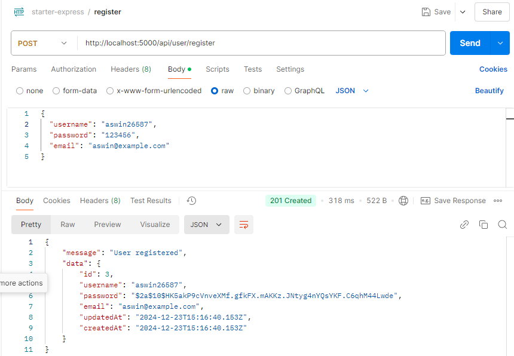

# Express.js Starter Kit

Proyek ini adalah starter pack untuk membangun backend menggunakan **Express.js** dengan fitur-fitur berikut:

- **ORM Sequelize** untuk pengelolaan database (MySQL).
- **dotenv** untuk konfigurasi variabel lingkungan.
- **JWT (JSON Web Token)** untuk autentikasi.
- **bcrypt.js** untuk hashing password.
- **Nodemon** untuk pengembangan dengan auto-reload server.

## Fitur Utama

1. **Autentikasi**:

   - Endpoint **Register**: Mendaftarkan pengguna baru.
   - Endpoint **Login**: Login dengan username dan password.
   - Endpoint **Protected**: Akses data profil dengan validasi JWT.

2. **CRUD Database**:

   - Menggunakan Sequelize dengan validasi dan constraint.

3. **Konfigurasi Mudah**:
   - File `.env` untuk mengatur port, secret key, dan detail koneksi database.

---

## Cara Menjalankan

1. **Clone Repo**:

   ```bash
   git clone <repo-url>
   cd <nama-folder-proyek>
   ```

2. **Install Dependencies**:

   ```bash
   npm install
   ```

3. **Konfigurasi `.env`**:
   Buat file `.env` di root directory dengan isi berikut:

   ```env
   PORT=5000
   JWT_SECRET=super_secret_key_12345
   DB_HOST=localhost
   DB_PORT=3306
   DB_USER=root
   DB_PASSWORD=
   DB_NAME=starter_express
   ```

4. **Inisialisasi Sequelize**:

   - Inisialisasi sequelize:
     ```bash
     npx sequelize-cli init
     ```

5. **Migrasi Database**:

   - Buat database di phpMyAdmin atau MySQL CLI:
     ```bash
     npx sequelize-cli db:create
     ```
   - Jalankan migration:
     ```bash
     npx sequelize-cli db:migrate
     ```

6. **Jalankan Server**:

   - Untuk mode pengembangan (dengan auto-reload):
     ```bash
     npm run dev
     ```
   - Untuk mode produksi:
     ```bash
     npm start
     ```

   Akses health check di [http://localhost:5000/api/health](http://localhost:5000/api/health).

---

## Struktur Proyek

```
├── config/
│   └── config.js
├── models/
│   └── index.js
│   └── user.js
├── migrations/
├── .env
├── package.json
└── index.js
```

---

## Endpoint API

1. **Health Check**  
   **GET** `/api/health`  
   Response: `"Tess Backend is running"`

2. **Register**  
   **POST** `/api/user/register`  
   Body:

   ```json
   {
     "username": "testuser",
     "password": "password123",
     "email": "user@example.com"
   }
   ```

   Response:

   - Success: `201 Created`
   - Error: `400 Bad Request`

   

3. **Login**  
   **POST** `/api/user/login`  
   Body:

   ```json
   {
     "username": "testuser",
     "password": "password123"
   }
   ```

   Response:

   - Success: `200 OK` (dengan token JWT)
   - Error: `401 Unauthorized`

   

4. **Profile** (Protected)  
   **GET** `/api/user/profile`  
   Header:  
   `Authorization: Bearer <JWT_TOKEN>`  
   Response:

   - Success: `200 OK`
   - Error: `401 Unauthorized`

   

---

## Tools yang Digunakan

- **Node.js**: Backend server.
- **Express.js**: Framework untuk API.
- **MySQL**: Database relasional.
- **Sequelize**: ORM untuk mengelola database.
- **JWT**: Untuk autentikasi berbasis token.
- **bcrypt.js**: Untuk hashing password.

---

## Cara Testing API

Gunakan tools seperti **Postman** untuk mencoba endpoint. Misalnya:

1. Register pengguna baru.
2. Login untuk mendapatkan token JWT.
3. Gunakan token untuk mengakses endpoint **/api/profile**.

---

## Kontribusi

1. Fork repository ini.
2. Buat branch untuk fitur baru: `git checkout -b feature/nama-fitur`.
3. Commit perubahan: `git commit -m "Menambahkan fitur baru"`.
4. Push ke branch Anda: `git push origin feature/nama-fitur`.
5. Ajukan pull request.

---

## Lisensi

Proyek ini dilisensikan di bawah [MIT License](LICENSE).
